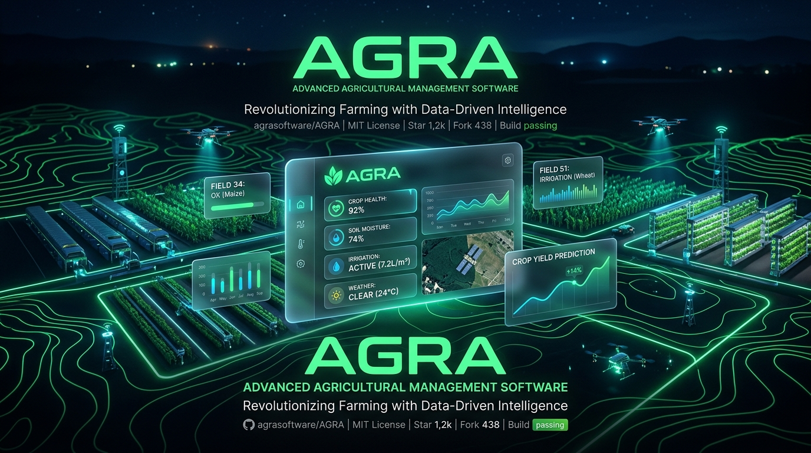

  

  
  <h1>AGRA Plataforma</h1>
  
<b>O Futuro da Gestão Rural Inteligente & Sustentável</b>

  
  

    
    
    
    
  

---

O **AGRA** é uma plataforma de gestão de fazendas Premium, desenhada para Produtores Rurais que exigem o máximo de performance. Ele transforma dados de solo, água, tarefas operacionais e clima em **inteligência agronômica de alto nível**, ajudando a produzir mais, gastar menos e preservar o ecossistema.

> **Do dado no campo à decisão de manejo, operando 100% offline se necessário.**

## ✨ Arquitetura & Inovação

### 📶 100% Offline-First (Sincronização "Seamless")
Fazendas frequentemente não possuem cobertura de internet. O AGRA foi construído para funcionar de forma ultrarrápida sem conexão usando IndexedDB/LocalStorage. Quando a conexão (3G/4G/Starlink) é reestabelecida, nosso **Motor de Sincronização Seamless** injeta todos os dados acumulados silenciosamente no backend.

### 🛡️ Segurança Corporativa em 3 Níveis
1. **Row Level Security (RLS)**: Os dados na nuvem (Supabase) são bloqueados a nível de tabela (PostgreSQL). Nenhuma conta consegue ler a fazenda de outra, mesmo se a API Key for vazada.
2. **Obfuscação Severa**: O Build da versão Web ofusca violentamente a estrutura do Javascript (`npm run build:web`), protegendo contra engenharia reversa.
3. **Trava de Assinaturas no Servidor**: Planos "Básicos" são impedidos fisicamente pelo Banco de Dados de acessar ou enviar dados de recursos Premium (como a criação de múltiplas fazendas).

## 🚀 Módulos da Plataforma

- 📊 **Gestão de Fazendas e Talhões**: Dashboard responsivo com telemetria (Área, Cultura, Umidade, Clima local).
- 🚜 **Logística de Atividades**: Distribua tarefas diárias por funcionário (Plantio, Pulverização, Colheita).
- 💰 **Monetização e Paywall**: Integração SDK de pagamentos. Planos "Operação" e "Vitalício".
- 🌿 **Inventário de Carbono e Sustentabilidade**: Monitore a saúde do solo e o sequestro de carbono usando diretrizes oficiais.
- 📚 **Biblioteca Técnica (Embrapa)**: Base de conhecimento avançado sobre ILPF, Plantio Direto e correção de acidez nativa na interface.

## 🛠️ Stack Tecnológica (Tech Stack)

| Frontend | Backend & DB | Integrações | Build & Security |
| :--- | :--- | :--- | :--- |
| HTML5 Semântico | Supabase (PostgreSQL) | Mercado Pago SDK | Node.js Build Script |
| Vanilla JS (ES6+) | Row Level Security (RLS) | OpenWeatherMap API | JSObfuscator |
| Glassmorphism CSS | Serverless Functions | Dexie.js (IndexedDB) | Crypto.randomUUID |

---

## 📲 Como Instalar e Testar

### 🌐 1. Nuvem / Web App (Mais Recomendado)
A versão mais rápida e atualizada, perfeitamente responsiva para PC, Tablet e Celular.
👉 **[Acessar a Plataforma AGRA Online](https://jhemym.github.io/AMA/dist/web/)** 

### 💻 2. Versão Desktop (Windows)
Ideal para computadores rurais sem internet ou escritórios de balança.
1. Vá na aba [Releases do GitHub](https://github.com/JhemyM/AMA/releases/latest).
2. Baixe o `.exe` oficial mais recente.
3. Não precisa instalar, é só abrir e usar.

---

## 🤝 Parcerias & Licenciamento

O AGRA é uma plataforma proprietária e de grau comercial. Se você é uma Cooperativa, Usina, Integrador B2B ou deseja licenciar a tecnologia para sua região:
- [Consulte nossos Termos Institucionais](protecao_e_licenciamento.md)

 

  Construído com obsessão por UI/UX (Premium Glassmorphism) e escalabilidade. 
  Copyright © Jhemy Martins. Todos os direitos reservados.

